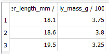
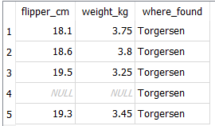
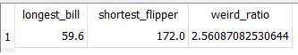
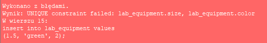
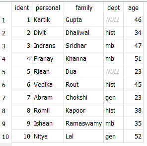
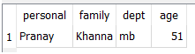
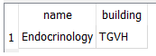
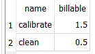
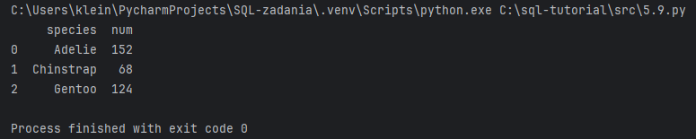
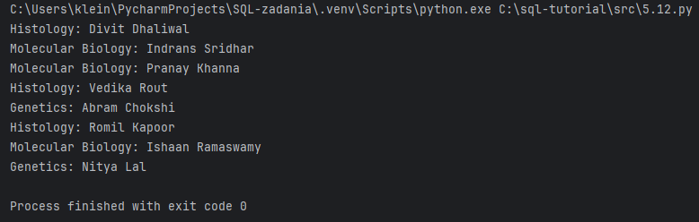

# SQL zadania

## Core Features- rozdział 2

### zadanie 1- Selecting Constant

`select 1;`


### zadanie 2- Selecting All Values from Table
`select * from little_penguins;`


### zadanie 3- Administrative Commands
`.headers on
.mode markdown
select * from little_penguins;`


### zadanie 4- Specifying Columns
`select
    species,
    island,
    sex
from little_penguins;`


### zadanie 5- Sorting
`select
    species,
    sex,
    island
from little_penguins
order by island asc, sex desc;`


### zadanie 6- Limiting Output
`select
    species,
    sex,
    island
from penguins
order by species, sex, island
limit 10;`


### zadanie 7- Paging Output
`select
    species,
    sex,
    island
from penguins
order by species, sex, island
limit 10 offset 3;`


### zadanie 8- Removing Duplicates
`select distinct
    species,
    sex,
    island
from penguins;`


### zadanie 9- Filtering Results
`select distinct
    species,
    sex,
    island
from penguins
where island = 'Biscoe';`


### zadanie 10- Filtering with More Complex Conditions
`select distinct
    species,
    sex,
    island
from penguins
where island = 'Biscoe' and sex != 'MALE';`


### zadanie 11- Doing Calculations
`select
    flipper_length_mm / 10.0,
    body_mass_g / 1000.0
from penguins
limit 3;`



### zadanie 12- Renaming Columns
`select
    flipper_length_mm / 10.0 as flipper_cm,
    body_mass_g / 1000.0 as weight_kg,
    island as where_found
from penguins
limit 3;`


### zadanie 13- Calculating with Missing Values
`select
    flipper_length_mm / 10.0 as flipper_cm,
    body_mass_g / 1000.0 as weight_kg,
    island as where_found
from penguins
limit 5;`


### zadanie 14- Null Equality
`select distinct
    species,
    sex,
    island
from penguins
where island = 'Biscoe';`


`select distinct
    species,
    sex,
    island
from penguins
where island = 'Biscoe' and sex = 'FEMALE';`


### zadanie 15- Null Inequality
`select distinct
    species,
    sex,
    island
from penguins
where island = 'Biscoe' and sex != 'FEMALE';`


### zadanie 16- Ternary Logic
`select null = null;`


### zadanie 17-Handling Null Safely
`select
    species,
    sex,
    island
from penguins
where sex is null;`


### zadanie 18- Aggregating
`select sum(body_mass_g) as total_mass
from penguins;`


### zadanie 19- Common Aggregation Functions
`select
    max(bill_length_mm) as longest_bill,
    min(flipper_length_mm) as shortest_flipper,
    avg(bill_length_mm) / avg(bill_depth_mm) as weird_ratio
from penguins;`


### zadanie 20- Counting
`select
    count(*) as count_star,
    count(sex) as count_specific,
    count(distinct sex) as count_distinct
from penguins;`


### zadanie 21- Grouping
`select avg(body_mass_g) as average_mass_g
from penguins
group by sex;`


### zadanie 22- Behavior of Unaggregated Columns
`select
    sex,
    avg(body_mass_g) as average_mass_g
from penguins
group by sex;`


### zadanie 23- Arbitrary Choice in Aggregation
`select
    sex,
    body_mass_g
from penguins
group by sex;`


### zadanie 24- Filtering Aggregated Values
`select
    sex,
    avg(body_mass_g) as average_mass_g
from penguins
group by sex
having average_mass_g > 4000.0;`


### zadanie 25-Readable Output
`select
    sex,
    round(avg(body_mass_g), 1) as average_mass_g
from penguins
group by sex
having average_mass_g > 4000.0;`


### zadanie 26- Filtering Aggregate Inputs
`select
    sex,
    round(
        avg(body_mass_g) filter (where body_mass_g < 4000.0),
        1
    ) as average_mass_g
from penguins
group by sex;`


### zadanie 27-Creating In-memory Database
Creating Tables

`create table job (
    name text not null,
    billable real not null
);
create table work (
    person text not null,
    job text not null
);`

Inserting Data

`insert into job values
('calibrate', 1.5),
('clean', 0.5);
insert into work values
('mik', 'calibrate'),
('mik', 'clean'),
('mik', 'complain'),
('po', 'clean'),
('po', 'complain'),
('tay', 'complain');`

Updating rows

`update work
set person = 'tae'
where person = 'tay';`

Delating rows

```
delete from work
where person = 'tae';

select * from work;
```


Backing up
```
create table backup (
    person text not null,
    job text not null
);

insert into backup
select
    person,
    job
from work
where person = 'tae';

delete from work
where person = 'tae';

select * from backup;
```
Combining Information

`select *
from work cross join job;`


Inner Join

`select *
from work inner join job
    on work.job = job.name;`


Aggregating Joined Data

`select
    work.person,
    sum(job.billable) as pay
from work inner join job
    on work.job = job.name
group by work.person;`


Left Join

`select *
from work left join job
    on work.job = job.name;`


Aggregating Left Joins

`select
    work.person,
    sum(job.billable) as pay
from work left join job
    on work.job = job.name
group by work.person;`


Coalescing Values

`select
    work.person,
    coalesce(sum(job.billable), 0.0) as pay
from work left join job
    on work.job = job.name
group by work.person`


Full Outer Join

```
create table size (
    s text not null
);
insert into size values ('light'), ('heavy');

create table weight (
    w text not null
);

select * from size full outer join weight;
```


## Tools- rozdział 3

### zad 1- Negating Incorrectly
`select distinct person
from work
where job != 'calibrate';`


### zad 2- Set Membership
`select *
from work
where person not in ('mik', 'tay');`


### zad 3- Subqueries

`select distinct person
from work
where person not in (
    select distinct person
    from work
    where job = 'calibrate'
);`


### zad 4- Defining a Primary Key
```
create table lab_equipment (
    size real not null,
    color text not null,
    num integer not null,
    primary key (size, color)
);

insert into lab_equipment values
(1.5, 'blue', 2),
(1.5, 'green', 1),
(2.5, 'blue', 1);

select * from lab_equipment;

insert into lab_equipment values
(1.5, 'green', 2);
```


### zad 5- Autoincrementing and Primary Keys
`create table person (
    ident integer primary key autoincrement,
    name text not null
);
insert into person values
(null, 'mik'),
(null, 'po'),
(null, 'tay');
select * from person;
insert into person values (1, 'prevented');`


### zad 6-Internal Tables
`select * from sqlite_sequence;`


### zad 7- Altering Tables
```
alter table job
add ident integer not null default -1;

update job
set ident = 1
where name = 'calibrate';

update job
set ident = 2
where name = 'clean';

select * from job;
```


### zad 8- Creating New Tables from Old
```
create table new_work (
    person_id integer not null,
    job_id integer not null,
    foreign key (person_id) references person (ident),
    foreign key (job_id) references job (ident)
);

insert into new_work
select
    person.ident as person_id,
    job.ident as job_id
from
    (person inner join work on person.name = work.person)
    inner join job on job.name = work.job;
select * from new_work;
```


### zad 9- Removing Tables
```
drop table work;
alter table new_work rename to work;
CREATE TABLE job (
    ident integer primary key autoincrement,
    name text not null,
    billable real not null
);
CREATE TABLE sqlite_sequence(name,seq);
CREATE TABLE person (
    ident integer primary key autoincrement,
    name text not null
);
CREATE TABLE IF NOT EXISTS "work" (
    person_id integer not null,
    job_id integer not null,
    foreign key(person_id) references person(ident),
    foreign key(job_id) references job(ident)
);
```

### zad 10- Comparing Individual Values to Aggregates
`select body_mass_g
from penguins
where
    body_mass_g > (
        select avg(body_mass_g)
        from penguins
    )
limit 5;`


### zad 11- Comparing Individual Values to Aggregates Within Groups
```
select
    penguins.species,
    penguins.body_mass_g,
    round(averaged.avg_mass_g, 1) as avg_mass_g
from penguins inner join (
    select
        species,
        avg(body_mass_g) as avg_mass_g
    from penguins
    group by species
) as averaged
    on penguins.species = averaged.species
where penguins.body_mass_g > averaged.avg_mass_g
limit 5;
```


### zad 12- Common Table Expressions
```
with grouped as (
    select
        species,
        avg(body_mass_g) as avg_mass_g
    from penguins
    group by species
)

select
    penguins.species,
    penguins.body_mass_g,
    round(grouped.avg_mass_g, 1) as avg_mass_g
from penguins inner join grouped
where penguins.body_mass_g > grouped.avg_mass_g
limit 5;
```


### zad 13- Explaining Query Plans
`explain query plan
select
    species,
    avg(body_mass_g)
from penguins
group by species;`


### zad 14- Enumerating Rows
`select
    rowid,
    species,
    island
from penguins
limit 5;`


### zad 15- Conditionals
```
with sized_penguins as (
    select
        species,
        iif(
            body_mass_g < 3500,
            'small',
            'large'
        ) as size
    from penguins
    where body_mass_g is not null
)

select
    species,
    size,
    count(*) as num
from sized_penguins
group by species, size
order by species, num;
```


### zad 16- Selecting a Case
```
with sized_penguins as (
    select
        species,
        case
            when body_mass_g < 3500 then 'small'
            when body_mass_g < 5000 then 'medium'
            else 'large'
        end as size
    from penguins
    where body_mass_g is not null
)

select
    species,
    size,
    count(*) as num
from sized_penguins
group by species, size
order by species, num;
```


### zad 17- Checking a Range
```
with sized_penguins as (
    select
        species,
        case
            when body_mass_g between 3500 and 5000 then 'normal'
            else 'abnormal'
        end as size
    from penguins
    where body_mass_g is not null
)

select
    species,
    size,
    count(*) as num
from sized_penguins
group by species, size
order by species, num;
```


### zad 18-Yet Another Database
`select * from staff;`


### zad 19- Pattern Matching
`select
    personal,
    family
from staff
where personal like '%ya%';`


### zad 20- Selecting First and Last Rows
`select * from (
    select * from (select * from experiment order by started asc limit 5)
    union all
    select * from (select * from experiment order by started desc limit 5)
)
order by started asc;`


### zad 21- Intersection
`select
    personal,
    family,
    dept,
    age
from staff
where dept = 'mb'
intersect
select
    personal,
    family,
    dept,
    age from staff
where age < 50;`


### zad 22- Exclusion
`select
    personal,
    family,
    dept,
    age
from staff
where dept = 'mb'
except
    select
        personal,
        family,
        dept,
        age from staff
    where age < 50;`



### zad 23- Random Numbers and Why Not
```
with decorated as (
    select random() as rand,
    personal || ' ' || family as name
    from staff
)

select
    rand,
    abs(rand) % 10 as selector,
    name
from decorated
where selector < 5; 
```


### zad 24- Creating an Index
```
explain query plan
select filename
from plate
where filename like '%07%';

create index plate_file on plate(filename);

explain query plan
select filename
from plate
where filename like '%07%';
```


### zad 25- Generating Sequences
`select value from generate_series(1, 5);`

### zad 26- Generating Sequences Based on Data
`create table temp (
    num integer not null
);
insert into temp values (1), (5);
select value from generate_series (
    (select min(num) from temp),
    (select max(num) from temp)
);`

### zad 27- Generating Sequences of Dates
`select date((select julianday(min(started)) from experiment) + value) as some_day
from (
    select value from generate_series(
        (select 0),
        (select julianday(max(started)) - julianday(min(started)) from experiment)
    )
)
limit 5;`

### zad 28- Counting Experiments Started per Day Without Gaps
```
with
-- complete sequence of days with 0 as placeholder for number of experiments
all_days as (
    select
        date((select julianday(min(started)) from experiment) + value) as some_day,
        0 as zeroes
    from (
        select value from generate_series(
            (select 0),
            (select count(*) - 1 from experiment)
        )
    )
),

-- sequence of actual days with actual number of experiments started
actual_days as (
    select
        started,
        count(started) as num_exp
    from experiment
    group by started
)

-- combined by joining on day and taking actual number (if available) or zero
select
    all_days.some_day as day,
    coalesce(actual_days.num_exp, all_days.zeroes) as num_exp
from
    all_days left join actual_days on all_days.some_day = actual_days.started
limit 5;
```

### zad 29- Self Join
```
with person as (
    select
        ident,
        personal || ' ' || family as name
    from staff
)

select
    left_person.name,
    right_person.name
from person as left_person inner join person as right_person
limit 10;
```


### zad 30-Generating Unique Pairs
```
with person as (
    select
        ident,
        personal || ' ' || family as name
    from staff
)

select
    left_person.name,
    right_person.name
from person as left_person inner join person as right_person
on left_person.ident < right_person.ident
where left_person.ident <= 4 and right_person.ident <= 4;
```


### zad 31- Filtering Pairs
```
with
person as (
    select
        ident,
        personal || ' ' || family as name
    from staff
),

together as (
    select
        left_perf.staff as left_staff,
        right_perf.staff as right_staff
    from performed as left_perf inner join performed as right_perf
        on left_perf.experiment = right_perf.experiment
    where left_staff < right_staff
)

select
    left_person.name as person_1,
    right_person.name as person_2
from person as left_person inner join person as right_person join together
    on left_person.ident = left_staff and right_person.ident = right_staff;
```


### zad 32- Existence and Correlated Subqueries
```
select
    name,
    building
from department
where
    exists (
        select 1
        from staff
        where dept = department.ident
    )
order by name
```


### zad 33- Nonexistence
`select
    name,
    building
from department
where
    not exists (
        select 1
        from staff
        where dept = department.ident
    )
order by name;
`


### zad 34- Avoiding Correlated Subqueries
`select distinct
    department.name as name,
    department.building as building
from department inner join staff
    on department.ident = staff.dept
order by name;`


### zad 35- Lead and Lag
```
with ym_num as (
    select
        strftime('%Y-%m', started) as ym,
        count(*) as num
    from experiment
    group by ym
)

select
    ym,
    lag(num) over (order by ym) as prev_num,
    num,
    lead(num) over (order by ym) as next_num
from ym_num
order by ym;
```


### zad 36- Windowing Functions
```with ym_num as (
    select
        strftime('%Y-%m', started) as ym,
        count(*) as num
    from experiment
    group by ym
)

select
    ym,
    num,
    sum(num) over (order by ym) as num_done,
    (sum(num) over (order by ym) * 1.00) / (select sum(num) from ym_num) as completed_progress,
    cume_dist() over (order by ym) as linear_progress
from ym_num
order by ym;
```


### zad 37- Explaining Another Query Plan
`explain query plan
with ym_num as (
    select
        strftime('%Y-%m', started) as ym,
        count(*) as num
    from experiment
    group by ym
)
select
    ym,
    num,
    sum(num) over (order by ym) as num_done,
    cume_dist() over (order by ym) as progress
from ym_num
order by ym;`


### zad 38- Partitioned Windows
```
with y_m_num as (
    select
        strftime('%Y', started) as year,
        strftime('%m', started) as month,
        count(*) as num
    from experiment
    group by year, month
)

select
    year,
    month,
    num,
    sum(num) over (partition by year order by month) as num_done
from y_m_num
order by year, month;
```


## Advanced Features- rozdział 4

### zad 1- Blobs
```
create table images (
    name text not null,
    content blob
);

insert into images (name, content) values
('biohazard', readfile('img/biohazard.png')),
('crush', readfile('img/crush.png')),
('fire', readfile('img/fire.png')),
('radioactive', readfile('img/radioactive.png')),
('tripping', readfile('img/tripping.png'));

select
    name,
    length(content)
from images;
```

### zad 2- Yet Another Database
`.schema`

```

CREATE TABLE sqlite_sequence(name,seq);
CREATE TABLE person(
       ident            integer primary key autoincrement,
       details          text not null
);
CREATE TABLE machine(
       ident            integer primary key autoincrement,
       name             text not null,
       details          text not null
);
CREATE TABLE usage(
       ident            integer primary key autoincrement,
       log              text not null
);
```

### zad 3-Storing JSON
`select * from machine;`


### zad 4- Select Fields from JSON
`select
    details->'$.acquired' as single_arrow,
    details->>'$.acquired' as double_arrow
from machine;`

### zad 5- JSON Array Access
`select
    ident,
    json_array_length(log->'$') as length,
    log->'$[0]' as first
from usage;`

### zad 6-Unpacking JSON Arrays
`select
    ident,
    json_each.key as key,
    json_each.value as value
from usage, json_each(usage.log)
limit 10;`


### zad 7- Selecting the Last Element of an Array
`select
    ident,
    log->'$[#-1].machine' as final
from usage
limit 5;`

### zad 8- Modifying JSON
`select
    ident,
    name,
    json_set(details, '$.sold', json_quote('2024-01-25')) as updated
from machine;`


### zad 9- Refreshing the Penguins Database
`select
    species,
    count(*) as num
from penguins
group by species;
`


### zad 10- Tombstones
```
alter table penguins
add active integer not null default 1;

update penguins
set active = iif(species = 'Adelie', 0, 1);
```
`select
    species,
    count(*) as num
from penguins
where active
group by species;`


### zad 11-Importing CSV Data
```
drop table if exists penguins;
.mode csv penguins
.import misc/penguins.csv penguins
update penguins set species = null where species = '';
update penguins set island = null where island = '';
update penguins set bill_length_mm = null where bill_length_mm = '';
update penguins set bill_depth_mm = null where bill_depth_mm = '';
update penguins set flipper_length_mm = null where flipper_length_mm = '';
update penguins set body_mass_g = null where body_mass_g = '';
update penguins set sex = null where sex = '';
```

### zad 12- Views
```
create view if not exists
active_penguins (
    species,
    island,
    bill_length_mm,
    bill_depth_mm,
    flipper_length_mm,
    body_mass_g,
    sex
) as
select
    species,
    island,
    bill_length_mm,
    bill_depth_mm,
    flipper_length_mm,
    body_mass_g,
    sex
from penguins
where active;

select
    species,
    count(*) as num
from active_penguins
group by species;
```
### zad 13- Hours Reminder
`create table job (
    name text not null,
    billable real not null
);
insert into job values
('calibrate', 1.5),
('clean', 0.5);
select * from job;`


### zad 14- Adding Checks
`create table job (
    name text not null,
    billable real not null,
    check (billable > 0.0)
);
insert into job values ('calibrate', 1.5);
insert into job values ('reset', -0.5);
select * from job;`

### zad 15- Transactions
```
create table job (
    name text not null,
    billable real not null,
    check (billable > 0.0)
);

insert into job values ('calibrate', 1.5);

begin transaction;
insert into job values ('clean', 0.5);
rollback;

select * from job;
```
### zad 16- Rollback in Constraints
```
create table job (
    name text not null,
    billable real not null,
    check (billable > 0.0) on conflict rollback
);

insert into job values
    ('calibrate', 1.5);
insert into job values
    ('clean', 0.5),
    ('reset', -0.5);

select * from job;
```

### zad 17- Rollback in Statements
```
create table job (
    name text not null,
    billable real not null,
    check (billable > 0.0)
);

insert or rollback into job values
('calibrate', 1.5);
insert or rollback into job values
('clean', 0.5),
('reset', -0.5);

select * from job;
```

### zad 18- Upsert
```
create table jobs_done (
    person text unique,
    num integer default 0
);

insert into jobs_done values
('zia', 1);
.print 'after first'
select * from jobs_done;
.print


insert into jobs_done values
('zia', 1);
.print 'after failed'
select * from jobs_done;

insert into jobs_done values
('zia', 1)
on conflict(person) do update set num = num + 1;
.print '\nafter upsert'
select * from jobs_done;
```
### zad 19- Creating Triggers
```
-- Track hours of lab work.
create table job (
    person text not null,
    reported real not null check (reported >= 0.0)
);

-- Explicitly store per-person total rather than using sum().
create table total (
    person text unique not null,
    hours real
);

-- Initialize totals.
insert into total values
('gene', 0.0),
('august', 0.0);

-- Define a trigger.
create trigger total_trigger
before insert on job
begin
    -- Check that the person exists.
    select case
        when not exists (select 1 from total where person = new.person)
        then raise(rollback, 'Unknown person ')
    end;
    -- Update their total hours (or fail if non-negative constraint violated).
    update total
    set hours = hours + new.reported
    where total.person = new.person;
end;
```

### zad 20- Trigger Not Firing
`insert into job values
('gene', 1.5),
('august', 0.5),
('gene', 1.0);`


### zad 21- Trigger Firing
`insert into job values
('gene', 1.0),
('august', -1.0);`


### zad 22- Representing Graphs
```
create table lineage (
    parent text not null,
    child text not null
);
insert into lineage values
('Arturo', 'Clemente'),
('Darío', 'Clemente'),
('Clemente', 'Homero'),
('Clemente', 'Ivonne'),
('Ivonne', 'Lourdes'),
('Soledad', 'Lourdes'),
('Lourdes', 'Santiago');
```


`select * from lineage;
`


### zad 23- Recursive Queries
```
with recursive descendent as (
    select
        'Clemente' as person,
        0 as generations
    union all
    select
        lineage.child as person,
        descendent.generations + 1 as generations
    from descendent inner join lineage
        on descendent.person = lineage.parent
)

select
    person,
    generations
from descendent;
```


### zad 24- Contact Tracing Database
`select * from person;`


`select * from contact;`

### zad 25- Bidirectional Contacts
```
create temporary table bi_contact (
    left text,
    right text
);

insert into bi_contact
select
    left, right from contact
    union all
    select right, left from contact
;
```


### zad 26- Updating Group Identifiers
```
select
    left.name as left_name,
    left.ident as left_ident,
    right.name as right_name,
    right.ident as right_ident,
    min(left.ident, right.ident) as new_ident
from
    (person as left join bi_contact on left.name = bi_contact.left)
    join person as right on bi_contact.right = right.name;
```


### zad 27- Recursive Labeling
```
with recursive labeled as (
    select
        person.name as name,
        person.ident as label
    from
        person
    union -- not 'union all'
    select
        person.name as name,
        labeled.label as label
    from
        (person join bi_contact on person.name = bi_contact.left)
        join labeled on bi_contact.right = labeled.name
    where labeled.label < person.ident
)
select name, min(label) as group_id
from labeled
group by name
order by label, name;
```


## Python- rozdział 5

### zad 5.1- import sqlite3

db_path = 'C:/sql-tutorial/db/penguins-python5.db'
connection = sqlite3.connect(db_path)
cursor = connection.execute("select count(*) from penguins;")
rows = cursor.fetchall()
print(rows)

```
import sqlite3

db_path = 'C:/sql-tutorial/db/penguins-python5.db'
connection = sqlite3.connect(db_path)
cursor = connection.execute("select count(*) from penguins;")
rows = cursor.fetchall()
print(rows)
```


### zad 5.2- Incremental Fetch

```
import sqlite3
import sys

db_path = 'C:/sql-tutorial/db/penguins-python5.db'
connection = sqlite3.connect(db_path)
cursor = connection.cursor()
cursor = cursor.execute("select species, island from penguins limit 5;")
while row := cursor.fetchone():
    print(row)
```


### zad 5.3- Insert, Delete, and All That
```
import sqlite3

connection = sqlite3.connect(":memory:")
cursor = connection.cursor()
cursor.execute("create table example(num integer);")

cursor.execute("insert into example values (10), (20);")
print("after insertion", cursor.execute("select * from example;").fetchall())

cursor.execute("delete from example where num < 15;")
print("after deletion", cursor.execute("select * from example;").fetchall())
```


### zad 5.4- Interpolating Values
```
import sqlite3

connection = sqlite3.connect(":memory:")
cursor = connection.cursor()
cursor.execute("create table example(num integer);")

cursor.executemany("insert into example values (?);", [(10,), (20,)])
print("after insertion", cursor.execute("select * from example;").fetchall())
```


### zad 5.5- Script Execution
```
import sqlite3

SETUP = """\
drop table if exists example;
create table example(num integer);
insert into example values (10), (20);
"""

connection = sqlite3.connect(":memory:")
cursor = connection.cursor()
cursor.executescript(SETUP)
print("after insertion", cursor.execute("select * from example;").fetchall())
```


### zad 5.6- SQLite Exceptions in Python
```
import sqlite3

SETUP = """\
create table example(num integer check(num > 0));
insert into example values (10);
insert into example values (-1);
insert into example values (20);
"""

connection = sqlite3.connect(":memory:")
cursor = connection.cursor()
try:
    cursor.executescript(SETUP)
except sqlite3.Error as exc:
    print(f"SQLite exception: {exc}")
print("after execution", cursor.execute("select * from example;").fetchall())
```


### zad 5.7- Python in SQLite
```
import sqlite3

SETUP = """\
create table example(num integer);
insert into example values (-10), (10), (20), (30);
"""


def clip(value):
    if value < 0:
        return 0
    if value > 20:
        return 20
    return value


connection = sqlite3.connect(":memory:")
connection.create_function("clip", 1, clip)
cursor = connection.cursor()
cursor.executescript(SETUP)
for row in cursor.execute("select num, clip(num) from example;").fetchall():
    print(row)
```


### zad 5.8- Handling Dates and Times
```
from datetime import date
import sqlite3


# Convert date to ISO-formatted string when writing to database
def _adapt_date_iso(val):
    return val.isoformat()


sqlite3.register_adapter(date, _adapt_date_iso)


# Convert ISO-formatted string to date when reading from database
def _convert_date(val):
    return date.fromisoformat(val.decode())


sqlite3.register_converter("date", _convert_date)

SETUP = """\
create table events(
    happened date not null,
    description text not null
);
"""

connection = sqlite3.connect(":memory:", detect_types=sqlite3.PARSE_DECLTYPES)
cursor = connection.cursor()
cursor.execute(SETUP)

cursor.executemany(
    "insert into events values (?, ?);",
    [(date(2024, 1, 10), "started tutorial"), (date(2024, 1, 29), "finished tutorial")],
)

for row in cursor.execute("select * from events;").fetchall():
    print(row)
```


### zad 5.9- Pandas and SQL
```
import pandas as pd
import sqlite3
import sys

db_path = 'C:/sql-tutorial/db/penguins-python5.db'
connection = sqlite3.connect(db_path)
query = "select species, count(*) as num from penguins group by species;"
df = pd.read_sql(query, connection)
print(df)
```


### zad 5.10- Polars and SQL
```
import polars as pl
import sys

db_path = 'C:/sql-tutorial/db/penguins-python5.db'
uri = "sqlite:///{db_path}"
query = "select species, count(*) as num from penguins group by species;"
df = pl.read_database_uri(query, uri, engine="adbc")
print(df)
```

### zad 5.11- Object-Relational Mappers
```
from sqlmodel import Field, Session, SQLModel, create_engine, select
import sys


class Department(SQLModel, table=True):
    ident: str = Field(default=None, primary_key=True)
    name: str
    building: str


db_uri = "sqlite:///C:/sql-tutorial/db/assays.db"
engine = create_engine(db_uri)
with Session(engine) as session:
    statement = select(Department)
    for result in session.exec(statement).all():
        print(result)
```


### zad 5.12- Relations with ORMs
```
from typing import Optional
from sqlmodel import Field, Session, SQLModel, create_engine, select


class Staff(SQLModel, table=True):
    ident: str = Field(default=None, primary_key=True)
    personal: str
    family: str
    dept: Optional[str] = Field(default=None, foreign_key="department.ident")
    age: int

class Department(SQLModel, table=True):
    ident: str = Field(default=None, primary_key=True)
    name: str
    building: str

db_uri = "sqlite:///C:/sql-tutorial/db/assays.db"
engine = create_engine(db_uri)
SQLModel.metadata.create_all(engine)
with Session(engine) as session:
    statement = select(Department, Staff).where(Staff.dept == Department.ident)
    for dept, staff in session.exec(statement):
        print(f"{dept.name}: {staff.personal} {staff.family}")
```

